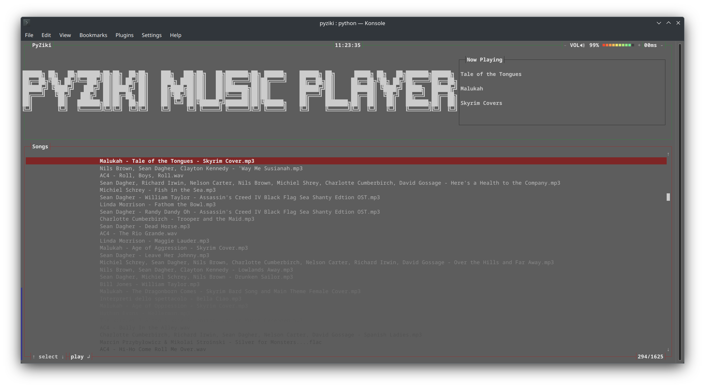
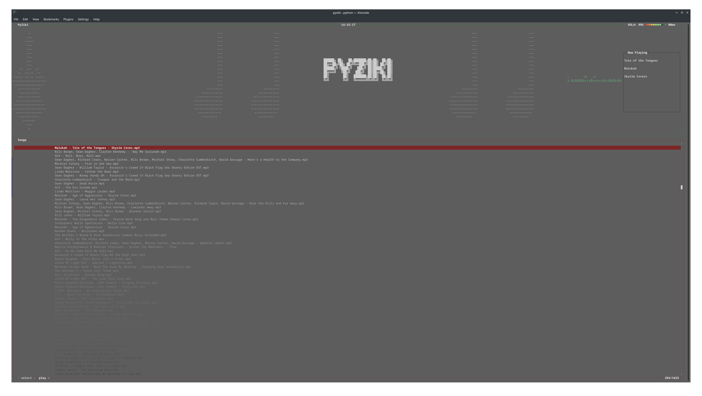

# PyZiki
A terminal music player implemented in python

Version 0.5.0

Version 0.6.0

### Dependencies
+ ffplayer   4.4.0
+ psutil     5.9.4
+ setuptools 67.1.0
+ wheel      0.38.4

(... and of course `pip`)

## TO-DO
- [ ] Seek bar
- [ ] Shuffle support
- [ ] Repeat support
- [ ] Installation/Execution guide
- [ ] Album art support
- [ ] Dynamic visualizer
- [ ] File system navigation

---

This particular version has been implemented via Python 3.10. Testing is ongoing.

PyZiki was inspired by the elegance that is bpyTOP. Please check the project out:
[bpyTOP](https://github.com/aristocratos/bpytop)
